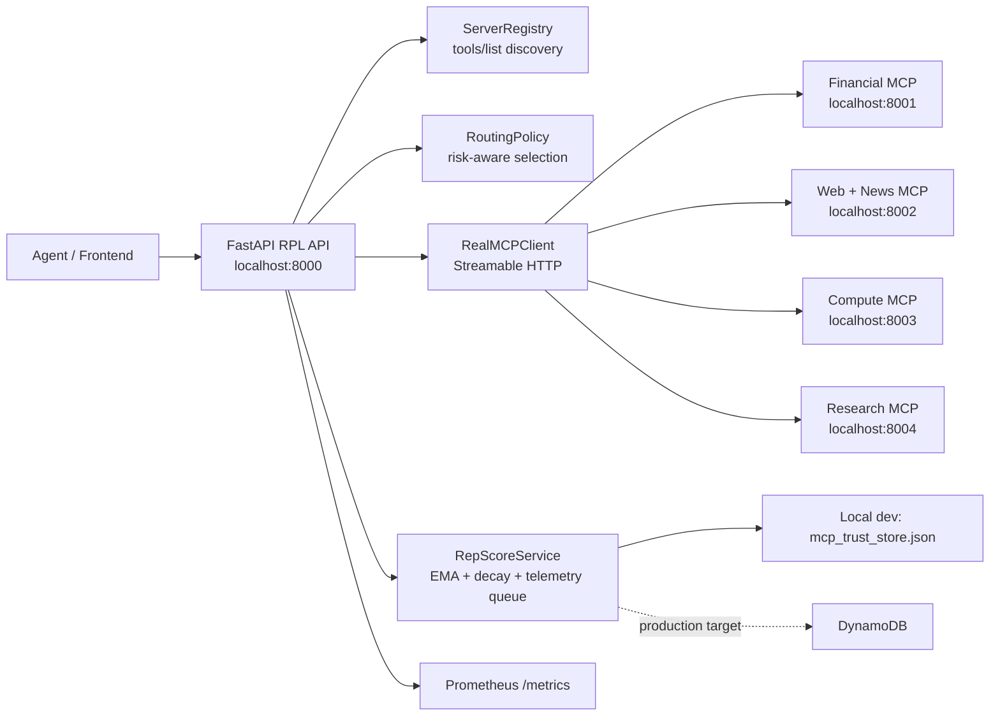

# MCP Reputation Policy Layer

Reputation-aware routing for real Model Context Protocol (MCP) servers.

The API sits between an agent and multiple MCP tool servers. It discovers the
tools exposed by each server, selects the best route using live reputation
scores and the agent's risk tolerance, executes the real MCP tool call, records
telemetry, and updates the trust state over time.

## Architecture



This is not an in-process simulation path. The production API path uses the MCP
Python SDK, opens Streamable HTTP sessions to separate MCP server processes, and
calls tools through JSON-RPC.

## Running The System

Install dependencies and create local environment config:

```bash
pip install -r requirements.txt
cp .env.example .env
```

Fill in the Azure OpenAI values in `.env`. Then start each process from the repo
root in a separate terminal:

```bash
python -m src.servers.financial_server
```

```bash
python -m src.servers.web_server
```

```bash
python -m src.servers.compute_server
```

```bash
python -m src.servers.research_server
```

```bash
PYTHONPATH=src uvicorn api:app --reload --host 0.0.0.0 --port 8000
```

Useful endpoints:

- `GET http://localhost:8000/api/v1/health`
- `GET http://localhost:8000/api/v1/servers`
- `POST http://localhost:8000/api/v1/execute`
- `GET http://localhost:8000/metrics`

Example execution request:

```bash
curl -X POST http://localhost:8000/api/v1/execute \
  -H "Content-Type: application/json" \
  -d '{
    "prompt": "What is the current stock price of AAPL?",
    "tool_type": "FINANCIAL_DATA",
    "goal": {
      "goal_type": "trading",
      "risk_tolerance": "low",
      "latency_priority": "high",
      "accuracy_priority": "high"
    }
  }'
```

## How The Protocol Works

At startup, the API discovers capabilities from every configured MCP server:

```json
{"jsonrpc":"2.0","id":1,"method":"initialize","params":{"protocolVersion":"2025-06-18"}}
```

```json
{"jsonrpc":"2.0","id":2,"method":"tools/list","params":{}}
```

At execution time, the RPL selects a route and calls the chosen tool:

```json
{
  "jsonrpc": "2.0",
  "id": 3,
  "method": "tools/call",
  "params": {
    "name": "get_financial_data",
    "arguments": {
      "query": "What is the current stock price of AAPL?",
      "source": "bloomberg"
    }
  }
}
```

The MCP SDK handles the transport details; `RealMCPClient` normalizes the tool
result into the API contract used by the frontend and the reputation service.

## Reputation Model

Each transaction records:

- outcome status
- latency
- compute cost
- client satisfaction derived from latency and confidence
- server confidence

The score update is an exponential moving average:

```text
new_score = alpha * weighted_current_signal + (1 - alpha) * previous_score
```

Scores also decay toward the default initial trust value when a server has not
been used recently. Risk tolerance adjusts the active threshold:

| Risk tolerance | Threshold |
| --- | ---: |
| low | 0.85 |
| medium | 0.70 |
| high | 0.50 |

If no server meets the threshold, the policy returns the best probationary
server instead of failing closed. That keeps the demo usable while making the
circuit-breaker state visible in the API and metrics.

## Observability

Prometheus metrics are exposed at `GET /metrics`:

- `rpl_requests_total{tool_type,status}`
- `rpl_routing_latency_seconds{server_id}`
- `rpl_reputation_score{server_id}`
- `rpl_circuit_breaker_active{server_id}`
- `rpl_telemetry_queue_size`

The API also emits structured JSON logs through `structlog` and attaches an
`X-Trace-Id` response header to each request.

## Configuration And Security

Required environment variables:

- `AZURE_OPENAI_API_KEY`
- `AZURE_OPENAI_ENDPOINT`
- `AZURE_OPENAI_DEPLOYMENT`
- `AZURE_OPENAI_API_VERSION`

Local CORS is intentionally narrow by default:

```text
CORS_ORIGINS=http://localhost:5173,http://localhost:3000
```

For production, set `CORS_ORIGINS` to the deployed frontend origin list. To add
MCP servers without changing code, configure:

```text
MCP_SERVER_URLS=https://server-a.example.com,https://server-b.example.com
```

The local development persistence layer writes to `mcp_trust_store.json`.
DynamoDB is the production persistence target for the same reputation metadata
and telemetry records.

## Project Structure

```text
.
|-- README.md
|-- requirements.txt
|-- pytest.ini
|-- src
|   |-- api.py
|   |-- config.py
|   |-- datastore.py
|   |-- mcp.py
|   |-- mcp_client.py
|   |-- metrics.py
|   |-- repservice.py
|   |-- rpl
|   |   |-- __init__.py
|   |   |-- policy.py
|   |   `-- registry.py
|   `-- servers
|       |-- __init__.py
|       |-- compute_server.py
|       |-- financial_server.py
|       |-- research_server.py
|       `-- web_server.py
`-- tests
    |-- conftest.py
    |-- test_api.py
    |-- test_ema_math.py
    |-- test_mcp_client.py
    `-- test_routing_policy.py
```

## Tests

Run the full suite:

```bash
PYTHONPATH=src pytest -q
```

Coverage includes reputation math, risk-aware routing, the real MCP transport
adapter with mocked SDK sessions, FastAPI endpoint contracts, and mocked
integration execution through the RPL stack.
