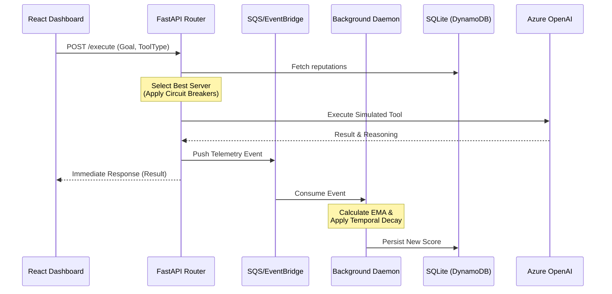

# Model Context Protocol (MCP) Reputation Policy Layer

A **dynamic trust fabric** and **enterprise routing layer** for autonomous AI Agents using the Model Context Protocol (MCP).

## The Problem
As AI agents move from experimental scripts to enterprise-grade autonomous systems, they rely on the **Model Context Protocol (MCP)** to interact with external tools and data sources. Currently, agents **blindly trust** these tools. If a backend database goes down, an API rate-limits, or a tool begins hallucinating, the agent fails catastrophically or enters infinite loops. The industry treats tools as static functions rather than dynamic, volatile infrastructure.

## The Solution
The **MCP Reputation Policy Layer (RPL)** introduces distributed systems concepts—Zero-Trust architecture, Circuit Breaking, and Latency-Based Routing—directly into the Agentic tooling layer. 

It acts as a middleware "Trust Fabric", constantly monitoring the performance of MCP servers (latency, cost, success rate) and maintaining a dynamic **Reputation Score** using an Exponential Moving Average (EMA). Agents no longer hardcode tool endpoints; instead, they query the RPL with a **Goal Configuration** (e.g., "I need Financial Data. I have low risk tolerance and require high accuracy"), and the RPL dynamically routes the execution to the most reliable, cost-effective server available.

---

## 🏗 System Architecture



The project is split into a highly concurrent, AWS-inspired Python backend and an Executive React Dashboard.

### 1. The Enterprise Python Backend (`/src`)
The backend is a fully asynchronous, stateless, event-driven engine designed to mimic world-class cloud infrastructure:

- **High-Concurrency API (`FastAPI`)**: 100% async non-blocking execution path capable of handling thousands of concurrent agent requests.
- **Stateless Persistence (`aiosqlite`)**: Simulates a Single-Table DynamoDB design. The in-memory state has been stripped out, making the API horizontally scalable.
- **Event-Driven Telemetry (Background Queues)**: Execution logs are pushed to an `asyncio.Queue` (simulating Amazon SQS). A background Daemon worker processes the queue, calculates the complex EMA math, and writes to the database asynchronously, ensuring the critical API path is never blocked.
- **Distributed Tracing (`structlog`)**: Every request generates an `X-Request-Id` that flows through the router, queue, and background worker, enabling perfect end-to-end observability.
- **Real LLM Execution**: Integrated with Azure OpenAI `gpt-4.1`. The backend actually queries the LLM to generate highly realistic, dynamic mock-data based on the chosen server, and generates a human-readable **Reasoning Narrative** explaining *why* the agent chose that specific server based on the user's risk tolerance.

### 2. The Executive Dashboard (`/app`)
A real-time observability dashboard built with **React**, **TailwindCSS**, and **TanStack Query**.

- **Goal-Conditioned Routing Sliders**: Users can dynamically adjust the Agent's Risk Tolerance, Latency Priority, and Accuracy Priority.
- **Real-Time Telemetry**: TanStack Query automatically polls and invalidates cache states, instantly updating the UI's dynamic reputation charts and waterfall logs as the background Python workers process telemetry.
- **X-Ray Waterfall Logging**: Deep observability into the routing decisions, execution latency, and LLM reasoning.

---

## The Trust Layer Math

The Reputation Policy Layer does not use simple averages. It utilizes a **Multi-Factor Exponential Moving Average (EMA) with Time-Based Decay**.

When a tool is executed, the backend calculates a `satisfaction_score` based on goal-conditioned weights:
```python
satisfaction = (Weight_Success * 1.0) + (Weight_Latency * Latency_Score) + (Weight_Cost * Cost_Score)
```

This is then smoothed into the server's historical reputation to prevent highly-reliable servers from being instantly circuit-broken by a single transient network failure:
```python
new_score = (Alpha_Smoothing * satisfaction) + ((1 - Alpha_Smoothing) * decayed_old_score)
```

If a server drops below the `0.70` threshold, the RPL applies an automatic **Circuit Breaker** and flags the server as `CIRCUIT_BROKEN`, preventing agents from routing critical tasks to it until its reputation recovers.

---

## 🚀 Getting Started

### Prerequisites
- Python 3.12+
- Node.js & Bun (for the frontend)
- Azure OpenAI Credentials

### 1. Setup the Backend
Navigate to the root directory and create your `.env` file:
```env
AZURE_OPENAI_ENDPOINT="https://your-endpoint.openai.azure.com"
AZURE_OPENAI_API_KEY="your-key"
AZURE_OPENAI_DEPLOYMENT="gpt-4.1"
AZURE_OPENAI_API_VERSION="2025-01-01-preview"
```

Install the dependencies and start the asynchronous server:
```bash
pip install fastapi uvicorn aiosqlite structlog openai python-dotenv pydantic
cd src
uvicorn api:app --reload
```
The API will run on `http://localhost:8000` and automatically create the SQLite database on startup.

### 2. Run the Frontend
In a new terminal, navigate to the Lovable application:
```bash
cd app
npm install
npm run dev
```

Open your browser. Adjust the Agent's goals, click "Execute Task", and watch the dynamic trust fabric in action!
