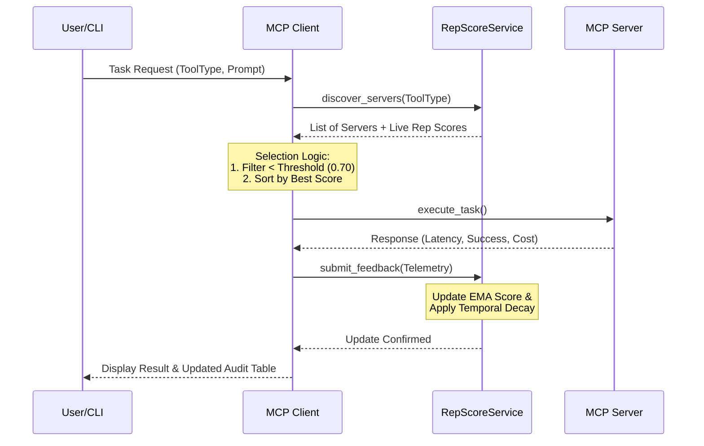

This code defines a simulated ecosystem for a **Model Context Protocol (MCP)**, which connects AI agents (clients) to tool servers 
(e.g., math computation, image generation, semantic search) using a **Reputation Policy Layer (RPL)**.

The RPL dynamically routes tasks to the best available servers based on **reputation, latency, reliability, cost, and feedback loops**. 
It simulates decentralized trust scoring—similar to how real distributed AI systems or APIs could self-optimize.

Core Components:
- `ToolType`, `Status` → Enumerations defining tool and status categories.
- `RepScoreConfig` → Configuration and constants for reputation scoring.
- `ServerCatalog` → Registry of available servers with metadata.
- `RepScoreService` → Centralized reputation scoring and management service.
- `MCP_Server` → Simulated backend tool provider (executes requests).
- `MCP_Client` → Intelligent agent that routes requests based on reputation.
- `interactive_agent_cli()` → CLI for user-driven simulation.

------------------------------------------------------------
2. ENUMERATIONS
------------------------------------------------------------
### ToolType
Defines categories of tools that servers can provide:
- MATH_COMPUTE
- DATA_RETRIEVAL
- REASONING
- IMAGE_GEN
- SEMANTIC_SEARCH

### Status
Defines transaction outcomes:
- SUCCESS
- ERROR
- TIMEOUT

------------------------------------------------------------
3. CONFIGURATION (RepScoreConfig)
------------------------------------------------------------
The `RepScoreConfig` class defines constants that govern the reputation model:

- WEIGHT_SATISFACTION (0.40)
- WEIGHT_RELIABILITY (0.30)
- WEIGHT_LATENCY_PENALTY (0.20)
- WEIGHT_COST_EFFICIENCY (0.10)

Each factor contributes to a weighted reputation update formula.
It also defines:
- MIN_REPUTATION_THRESHOLD: 0.70 (below this, a server is blocked)
- ALPHA_SMOOTHING: 0.1 (used for exponential moving average updates)
- MAX_ACCEPTABLE_LATENCY: 0.8 seconds
- COST_BENCHMARK: $0.005
- DEFAULT_INITIAL_SCORE: 0.50 (for new servers)
- REPUTATION_DECAY_HALF_LIFE_HOURS: 24

------------------------------------------------------------
4. SERVER CATALOG (ServerCatalog)
------------------------------------------------------------
A static dictionary containing server metadata:
Each entry includes:
- Tool type
- Cost per unit
- Error rate
- Average latency

Examples:
- compute_server_1: Math compute tool (fast, reliable)
- data_server_2: Data retrieval tool (very reliable)
- image_fast_4: Image generation (fast, expensive)
- image_cheap_5: Image generation (cheap, unreliable)
- semantic_db_6: Semantic search (very efficient)

------------------------------------------------------------
5. REPUTATION SERVICE (RepScoreService)
------------------------------------------------------------
Acts as the “trust fabric.” Responsible for storing and updating reputation scores.

Key methods:
- `_initialize_reputations()`: Sets initial scores for each server.
- `_apply_decay()`: Applies time-based score decay using half-life logic.
- `get_reputation()`: Returns the current (possibly decayed) score.
- `_get_avg_cost_for_tool()`: Calculates average cost for a given tool type.
- `discover_servers()`: Lists all servers by tool type and their live scores.
- `calculate_new_score()`: Updates reputation using multi-factor weighted logic.
- `submit_feedback()`: Updates server reputation after each task.

Reputation Decay Formula:
Each score decays toward DEFAULT_INITIAL_SCORE based on time since last update.

------------------------------------------------------------
6. SERVER SIMULATION (MCP_Server)
------------------------------------------------------------
Simulates tool providers that process client tasks.
When executed, each server:
- Randomly delays to simulate latency
- Has a probability of failure based on error_rate
- Returns success or error responses with metadata (cost, latency, confidence)

------------------------------------------------------------
7. CLIENT SIMULATION (MCP_Client)
------------------------------------------------------------
Represents an AI agent that routes tasks to servers intelligently.

Key features:
- Discovers servers by tool type.
- Filters out low-reputation servers.
- Selects the best option by live score.
- Executes a request and receives telemetry.
- Sends satisfaction feedback to update reputation.

### Satisfaction Model:
Derived automatically from latency and confidence metrics:
- High latency → lower satisfaction
- High confidence → higher satisfaction

### Core methods:
- `_select_best_server()`: Chooses best available server based on policy.
- `execute_task()`: Runs full lifecycle: discover → execute → feedback.
- `_interpret_policy_llm()`: Prints human-readable recommendation summaries.

------------------------------------------------------------
8. INTERACTIVE CLI
------------------------------------------------------------
The `interactive_agent_cli()` function runs an interactive session where users can:
- Select a tool type (e.g., IMAGE_GEN)
- Input a task prompt
- Watch the system route, execute, log, and update reputation dynamically

Example Flow:
1. User selects "Image Generation"
2. System evaluates all servers of that type
3. Chooses best based on live score & cost
4. Executes tool → Logs telemetry → Updates reputation
5. Displays updated scores and audit table

------------------------------------------------------------
9. EXECUTION FLOW SUMMARY
------------------------------------------------------------
1. Initialize RepScoreService → loads all servers & scores.
2. Initialize MCP_Client → loads tool servers & connects to the rep service.
3. Client routes requests based on dynamic reputation.
4. Reputation scores update after each transaction based on success, latency, cost, and satisfaction.
5. Decay over time ensures fairness and adaptability.

------------------------------------------------------------
10. DESIGN SIGNIFICANCE
------------------------------------------------------------
This architecture models how **decentralized AI ecosystems** might self-regulate trust without human oversight. 
It's modular, interpretable, and demonstrates:
- Multi-factor trust modeling
- Feedback-driven adaptation
- Dynamic routing
- Policy-layer observability (explainable recommendations)

Real-world analogues include:
- Load balancing with adaptive trust scores
- LLM agent tool selection logic
- Distributed ML service orchestration
