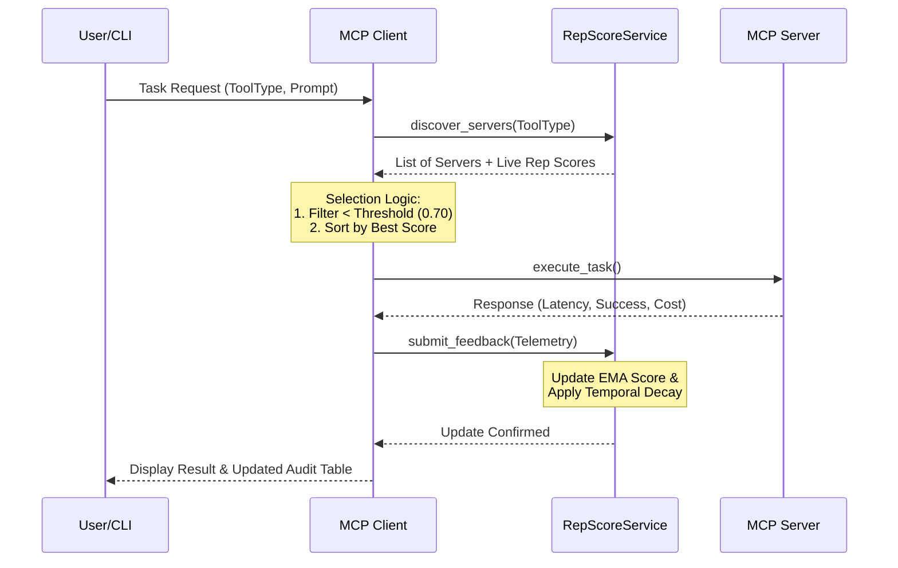

# Technical Specification: MCP Reputation Policy Layer (RPL)

## 1. System Overview

This system defines a simulated ecosystem for the **Model Context Protocol (MCP)**, where AI agents (clients) interact with tool servers (e.g., math computation, image generation, semantic search) through a **Reputation Policy Layer (RPL)**.

The RPL dynamically routes tasks to the most appropriate servers based on **reputation, latency, reliability, cost, and feedback loops**. The goal is to model a decentralized trust mechanism, similar to how real-world distributed AI systems or API marketplaces could self-optimize over time.

### Core Components

- **ToolType, Status**  
  Enumerations defining tool categories and execution outcomes.

- **RepScoreConfig**  
  Configuration and constants governing the reputation model.

- **ServerCatalog**  
  Registry of available servers and their metadata.

- **RepScoreService**  
  Centralized reputation scoring and management service.

- **MCP_Server**  
  Simulated backend tool provider responsible for execution.

- **MCP_Client**  
  Intelligent agent that routes tasks using reputation-aware policies.

- **interactive_agent_cli()**  
  CLI for user-driven simulation and observability.

---

## 2. Enumerations

### ToolType

Defines the categories of tools that servers can provide:

- `MATH_COMPUTE`
- `DATA_RETRIEVAL`
- `REASONING`
- `IMAGE_GEN`
- `SEMANTIC_SEARCH`

### Status

Defines transaction outcomes:

- `SUCCESS`
- `ERROR`
- `TIMEOUT`

---

## 3. Configuration (`RepScoreConfig`)

The `RepScoreConfig` class defines constants that govern how reputation scores are calculated and updated. Each factor contributes to a weighted reputation update formula.

### Reputation Weights

| Constant | Value | Description |
|--------|------|-------------|
| `WEIGHT_SATISFACTION` | 0.40 | Weighted impact of agent satisfaction |
| `WEIGHT_RELIABILITY` | 0.30 | Weighted impact of successful execution |
| `WEIGHT_LATENCY_PENALTY` | 0.20 | Weighted impact of response speed |
| `WEIGHT_COST_EFFICIENCY` | 0.10 | Weighted impact of cost vs benchmark |

### Operational Parameters

- **MIN_REPUTATION_THRESHOLD:** `0.70`  
  Servers below this score are excluded from routing.

- **ALPHA_SMOOTHING:** `0.1`  
  Smoothing factor for Exponential Moving Average updates.

- **MAX_ACCEPTABLE_LATENCY:** `0.8` seconds

- **COST_BENCHMARK:** `$0.005`

- **DEFAULT_INITIAL_SCORE:** `0.50`  
  Baseline reputation for newly registered servers.

- **REPUTATION_DECAY_HALF_LIFE_HOURS:** `24`  
  Controls time-based decay toward the baseline score.

---

## 4. Server Catalog (`ServerCatalog`)

A static registry containing metadata for all available servers. Each entry includes:

- Tool type
- Cost per unit
- Error rate
- Average latency

### Example Entries

- **compute_server_1**  
  Math compute tool (fast, reliable)

- **data_server_2**  
  Data retrieval tool (very reliable)

- **image_fast_4**  
  Image generation (fast, expensive)

- **image_cheap_5**  
  Image generation (cheap, unreliable)

- **semantic_db_6**  
  Semantic search (highly efficient)

---

## 5. Reputation Service (`RepScoreService`)

The `RepScoreService` acts as the system’s **trust fabric**, responsible for storing, updating, and exposing reputation scores.

### Key Responsibilities

- Initialize and persist reputation state
- Apply temporal decay
- Aggregate performance feedback
- Expose live scores for routing decisions

### Key Methods

- `_initialize_reputations()`  
  Sets initial scores for each server.

- `_apply_decay()`  
  Applies time-based decay using half-life logic.

- `get_reputation(server_id)`  
  Returns the current (decayed) reputation score.

- `discover_servers(tool_type)`  
  Lists all servers for a given tool type with live scores.

- `calculate_new_score(...)`  
  Computes updated reputation using multi-factor weighted logic.

- `submit_feedback(...)`  
  Updates server reputation after task completion.

### Reputation Decay

Each reputation score decays toward `DEFAULT_INITIAL_SCORE` based on the elapsed time since the last update, ensuring fairness and adaptability.

---

## 6. Server Simulation (`MCP_Server`)

The `MCP_Server` simulates backend tool providers. During execution, each server:

- Introduces random delays to simulate latency
- Fails probabilistically based on its `error_rate`
- Returns structured execution metadata:
  - Success or failure
  - Cost
  - Latency
  - Confidence score

---

## 7. Client Simulation (`MCP_Client`)

The `MCP_Client` represents an intelligent AI agent that routes tasks using reputation-aware logic.

### Key Features

- **Discovery**  
  Locates candidate servers by tool type.

- **Filtering**  
  Automatically excludes servers below the minimum reputation threshold.

- **Selection**  
  Chooses the optimal server based on live reputation and cost.

- **Telemetry**  
  Executes tasks and captures performance metrics.

- **Feedback Loop**  
  Submits satisfaction feedback to update global reputation state.

### Satisfaction Model

Agent satisfaction is derived automatically from execution telemetry:

- High latency → lower satisfaction  
- High confidence and success → higher satisfaction

---

## 8. Interactive CLI

The `interactive_agent_cli()` function provides a user-driven simulation interface.

### Example Flow

1. User selects **Image Generation**
2. System evaluates all servers of that tool type
3. Best server is selected based on live reputation and cost
4. Tool executes → telemetry is logged → reputation is updated
5. System displays updated scores and an audit table

---

## 9. Execution Flow Summary

1. **Initialize RepScoreService**  
   Loads server catalog and hydrates reputation scores.

2. **Initialize MCP_Client**  
   Connects to the reputation service.

3. **Route**  
   Client requests are routed using dynamic reputation scores.

4. **Update**  
   Reputation is updated based on success, latency, cost, and satisfaction.

5. **Decay**  
   Temporal decay ensures fairness and long-term adaptability.

---

## 10. Design Significance

This architecture demonstrates how decentralized AI ecosystems could self-regulate trust without human oversight. It is modular, interpretable, and highlights:

- **Multi-factor Trust Modeling**  
  Reputation goes beyond binary success or failure.

- **Feedback-driven Adaptation**  
  The system responds in real time to performance changes.

- **Dynamic Routing**  
  Agents consistently select the best available tools.

- **Policy-layer Observability**  
  Reputation and routing decisions are explainable and auditable.
